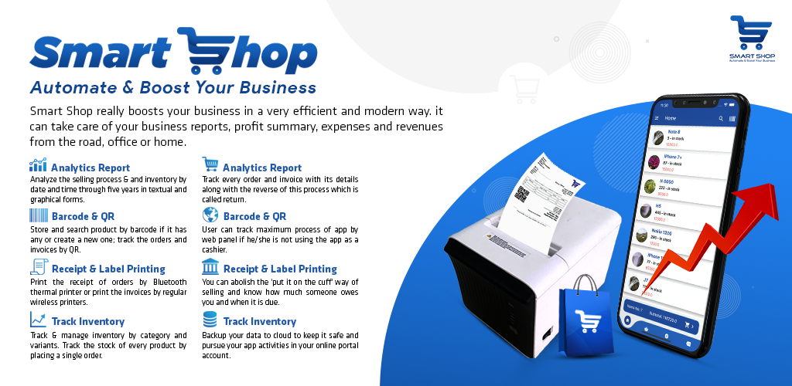
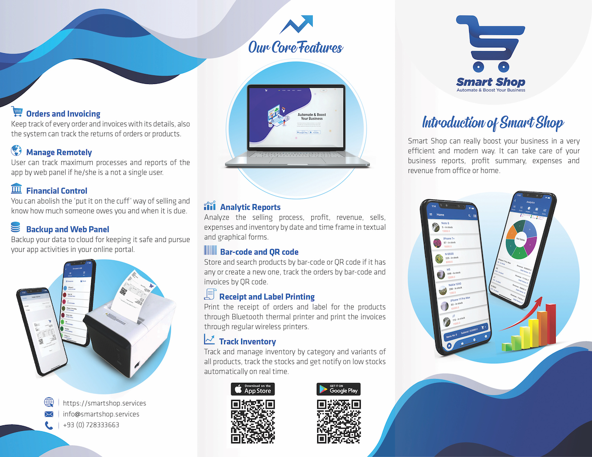

# Smart Shop - Point of Sale System

## Overview

**Smart Shop** is a comprehensive Point of Sale (POS) system tailored for small and medium-sized businesses. This web-app is point of a big project where two more mobile applications are also involved. Developed using Django for the backend and a combination of HTML, CSS, JavaScript, and Bootstrap for the frontend, Smart Shop offers an intuitive and powerful solution for managing business transactions, tracking inventory, and generating insightful analytics. Initially deployed in Kabul, Afghanistan, this application has proven to be an affordable and efficient alternative for businesses that require modern POS functionalities without the heavy investment in expensive systems.
For the complete Smart Shop experience, including the Mobile Apps (Android & iOS), visit the following link:

- [Smart Shop Mobile Apps](https://github.com/arifhaidari/smart_shop_services)



## Key Features

### 1. Orders and Invoicing

- **Order Tracking**: Keep a detailed record of every order, including order returns.
- **Invoice Management**: Generate and manage invoices with comprehensive details.
- **Return Handling**: Efficiently track and process product returns.

### 2. Manage Remotely

- **Web Panel Access**: Monitor and manage business processes from anywhere through an online web panel.
- **Multi-User Support**: Designed for use by multiple users, allowing super admins to manage other users such as shopkeepers.

### 3. Financial Control

- **Credit Management**: Eliminate the traditional 'put it on the cuff' system by accurately tracking customer debts and payment schedules.
- **Expense Tracking**: Monitor expenses and revenue for better financial control.

### 4. Backup and Web Panel

- **Cloud Backup**: Safeguard your business data by backing it up to the cloud.
- **Online Portal**: Continue managing your business activities through an online portal, ensuring data accessibility and security.

### 5. Analytic Reports

- **Sales Analysis**: Review and analyze sales data, profits, and revenue over custom timeframes.
- **Expense Reports**: Track expenses and understand their impact on the overall financial health of your business.
- **Inventory Analysis**: Evaluate inventory performance with detailed textual and graphical reports.

### 6. Bar-code and QR code Integration

- **Product Management**: Store and search products by bar-code or QR code, or create new codes for your products.
- **Order Tracking**: Utilize bar-codes and QR codes to efficiently track orders and invoices.

### 7. Receipt and Label Printing

- **Thermal Printer Support**: Print order receipts and product labels using Bluetooth thermal printers.
- **Wireless Printing**: Generate and print invoices via regular wireless printers.

### 8. Inventory Management

- **Category and Variant Tracking**: Manage inventory by categories and variants for all products.
- **Stock Monitoring**: Keep track of stock levels, with real-time notifications for low stock conditions.

## Additional Resources

### 1. Brochure



### 2. Promotional Video

[Watch the Promotional Video](https://www.youtube.com/watch?v=CGohh8mu5r8)

### 3. Tutorial Playlist

A comprehensive playlist of tutorials and user manuals is available to help you get the most out of Smart Shop.
[Watch the Tutorial Playlist](https://www.youtube.com/watch?v=OcSPNzoeV48&list=PLzZJPW96W8VN9rCsCsJ0Urm8uKwSTuHll)

## Technical Stack

- **Backend**: Django (Python)
- **Frontend**: HTML, CSS, JavaScript, Bootstrap
- **Database**: SQLite

This web application is part of a larger ecosystem, with mobile applications available for both Android and iOS, allowing users to manage their businesses on the go.

## Installation Guide

1. **Clone the Repository**:
   ```bash
   git clone <repository-url>
   cd smart-shop
   ```
2. **Set Up a Virtual Environment**:
   ```bash
   python3 -m venv venv
   source venv/bin/activate
   ```
3. **Install Dependencies**:
   ```bash
   pip install -r requirements.txt
   ```
4. **Run Migrations**:
   ```bash
   python manage.py migrate
   ```
5. **Start the Development Server**:
   ```bash
   python manage.py runserver
   ```

## Usage

- **Admin Panel**: Access the admin panel to manage users, inventory, and other critical aspects of the application.
- **User Dashboard**: Each user has a personalized dashboard to track their specific activities and reports.
- **Reports**: Utilize the reporting features to generate insights on sales, inventory, and finances.

## Contributing

We welcome contributions to the Smart Shop project. Please follow these steps:

1. Fork the repository.
2. Create a new branch (`git checkout -b feature-branch`).
3. Make your changes.
4. Commit your changes (`git commit -m 'Add new feature'`).
5. Push to the branch (`git push origin feature-branch`).
6. Create a pull request.

## License

**Copyright © 2021 Arif Haidari and FSH.**

This project was originally a private project and has been made public for educational and portfolio purposes only. **No part of this project, including the code, design, or any other materials, may be used, copied, modified, merged, published, distributed, sublicensed, or sold for production or commercial purposes without explicit permission from the copyright holder.**

Please respect the intellectual property rights and do not use this project for any production or commercial use.

---

## Contact

For inquiries, please contact:

- **Email:** arifhaidari336@gmail.com

---

**Smart Shop** - Automate & Boost Your Business!
